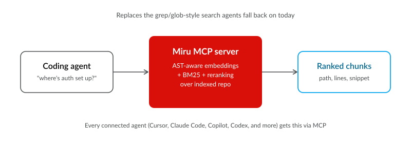

# Miru (見る)

[](https://github.com/takara-ai/miru-code/actions/workflows/ci.yml) [](./LICENSE) [](https://bun.sh)


**Hybrid code search for AI coding agents.** Find code by meaning, not grep.

Your AI agent finds the code it needs with up to 50% fewer tokens.

Miru returns the best **chunks** (path, lines, snippet) for questions like *"where is auth middleware configured?"* — plugged directly into Claude Code, Cursor, Copilot, Codex, and 9+ other agents via MCP.

---

## How it fits into your agent's workflow



Miru replaces the grep/glob-style search agents fall back on today. Install once, and every connected agent gets `search` and `find_related` MCP tools automatically.


## Install

```bash
bun add -g @takara-ai/miru-code
```

## Set up credentials

```bash
miru setup
```

Interactive `miru setup` defaults to device-code login and saves the resulting credentials locally. Manual bearer-token entry is still available with `--key`. If credentials are missing, the interactive MCP/plugin path can bootstrap the same device flow automatically on first use.

```bash
miru setup --device           # explicit device-code login
miru setup --key YOUR_TOKEN   # store a bearer token directly
miru setup --clear            # remove stored credentials
```

Miru stores versioned credentials in `credentials.json` and automatically loads or refreshes them for MCP and CLI use. `TAKARA_API_KEY` still overrides stored credentials when set explicitly.

## Add to your IDE

```bash
miru install
```

Interactive TUI — **↑↓** move, **space** toggle, **a** all, **enter** confirm. Pick agents and integrations:


| Integration                   | What it does                                                        |
| ----------------------------- | ------------------------------------------------------------------- |
| MCP server                    | `search`, `locate`, `expand`, and `find_related` tools in the agent |
| Instructions                  | Search policy in `CLAUDE.md` / `AGENTS.md` / `GEMINI.md`            |
| Sub-agent                     | Dedicated `miru-code` agent file                                    |
| Cursor rules                  | Always-on `.cursor/rules/miru-code.mdc` (Cursor only)               |
| Search hooks *(experimental)* | Block built-in Grep/Glob and redirect to Miru MCP                   |
| Caveman *(experimental)*      | On-demand chat compression skill (`/caveman`)                       |


Restart the IDE when done.

```bash
miru uninstall   # remove miru config
```

**Supported:** Cursor · Claude Code · Gemini CLI · Kiro · OpenCode · GitHub Copilot · Codex · VS Code · Visual Studio (Windows) · Windsurf / Devin Desktop


| IDE            | MCP                                   | Instructions / rules            | Hooks *(experimental)*                            | Caveman *(experimental)*                            |
| -------------- | ------------------------------------- | ------------------------------- | ------------------------------------------------- | --------------------------------------------------- |
| Cursor         | `~/.cursor/mcp.json`                  | `~/.cursor/rules/miru-code.mdc` | `~/.cursor/hooks.json`                            | `~/.cursor/skills/caveman/SKILL.md`                 |
| Claude Code    | `~/.claude.json`                      | `~/.claude/CLAUDE.md`           | `~/.claude/settings.json`                         | `~/.claude/skills/caveman/SKILL.md`                 |
| Gemini CLI     | `~/.gemini/settings.json`             | `~/.gemini/GEMINI.md`           | `~/.gemini/settings.json` (`BeforeTool`)          | `~/.gemini/skills/caveman/SKILL.md`                 |
| Kiro           | `~/.kiro/settings/mcp.json`           | `~/.kiro/steering/miru.md`      | `~/.kiro/settings/hooks.json`                     | `~/.kiro/skills/caveman/SKILL.md`                   |
| OpenCode       | `~/.config/opencode/opencode.json(c)` | `~/.config/opencode/AGENTS.md`  | `~/.config/opencode/plugins/miru-search-guard.ts` | `~/.config/opencode/skills/caveman/SKILL.md`        |
| GitHub Copilot | `~/.copilot/mcp-config.json`          | —                               | `~/.copilot/hooks/miru-search.json`               | `~/.copilot/skills/caveman/SKILL.md`                |
| Codex          | `~/.codex/config.toml`                | `~/.codex/AGENTS.md`            | `~/.codex/hooks.json`                             | `~/.codex/skills/caveman/SKILL.md`                  |
| VS Code        | `…/Code/User/mcp.json`                | —                               | `~/.copilot/hooks/miru-search.json`               | `~/.copilot/skills/caveman/SKILL.md`                |
| Visual Studio  | `%USERPROFILE%\.mcp.json`             | —                               | `~/.copilot/hooks/miru-search.json`               | `~/.copilot/skills/caveman/SKILL.md`                |
| Windsurf       | —                                     | —                               | `~/.codeium/windsurf/hooks.json`                  | `~/.codeium/windsurf/skills/caveman/SKILL.md`       |

### Plugin packaging

This repo now includes plugin packaging for:

- Codex: `.codex-plugin/plugin.json` and `.agents/plugins/marketplace.json`
- Claude Code: `.claude-plugin/plugin.json` and `.claude-plugin/marketplace.json`
- Cursor: `plugin.json` and `.cursor/rules/miru-code-search.mdc`

Current limitation:

- these plugin manifests still launch the published Miru runtime through `bunx @takara-ai/miru-code`
- that means local source edits do not affect plugin behavior until a package version is published
- and a fully self-contained “no Bun required” plugin install is still future work

### Search hooks

Sub-agent files are also written where supported (see `miru install` plan). Windsurf hooks only *(experimental)* — no MCP entry yet. Caveman is an on-demand Agent Skill (default off): invoke with `/caveman` or “talk like caveman”; stop with “normal mode”. Invocation UI varies by IDE (`/caveman`, `$caveman`, `@caveman`, etc.). Copilot / VS Code / Visual Studio share `~/.copilot/skills/caveman/SKILL.md` — uninstalling one keeps the skill if another of those IDEs is still detected; selecting all three removes it once.

<details>
<summary>Caveman mode <em>(experimental)</em></summary>

Caveman compresses **live chat replies** (less filler, max meaning). Intensities: `/caveman lite|full|ultra` (default full). Persisted artifacts (commits, PRs, customer docs) stay normal prose unless you ask otherwise.

Security / destructive warnings use clear normal prose (auto-clarity) — brevity never hides risk. Session token savings vary; the skill itself costs input tokens. No guaranteed %.

Off by default at install time. Enable Caveman in the installer for any supported IDE. Restart the IDE (or reload skills) after install. For Codex, the installer also sets `[features] skills = true` in `~/.codex/config.toml` (required for Codex to load skills).

</details>

<details>
<summary>Search hooks <em>(experimental)</em></summary>

Search hooks are **experimental** — behavior and IDE support may change between releases.

Hooks run `miru hook-guard` before built-in search tools execute. They **block** conceptual Grep/Glob/SemanticSearch and shell `rg`/`grep`/`find`, and tell the agent to use Miru MCP `search` (or `locate` for exact literals) instead. Exact literal lookups (e.g. `REDIS_HOST`, a symbol name) still pass through.

Hooks are **off by default** at install time. Enable them in the installer if you want built-in Grep/Glob redirected to Miru MCP.

</details>

**Team sub-agent in a repo** (optional):

```bash
miru init --agent claude --force
```

## Try it

Meaning-based questions → `search`. Exact strings (env vars, symbols, error codes) → `locate`.

```bash
miru search "auth middleware" ./src
miru locate REDIS_HOST ./src
miru expand src/auth.ts 42 ./src
miru find-related src/auth.ts 42 ./src
```

Terminal output is human-readable; use `--json` for scripts. One-off without installing:

```bash
bunx @takara-ai/miru-code search "auth middleware" ./src
```

---

## MCP tools

When wired via `miru install`, the MCP server exposes `search`, `locate`, `expand`, and `find_related`. `read_benchmark` appears only in [benchmark mode](#benchmark-mode). Pass the **project root** as `repo` for local workspaces (or an `https://` git URL). The index is built on the first call and cached for the session.


| Tool             | When to use                                                                             |
| ---------------- | --------------------------------------------------------------------------------------- |
| `search`         | Default for code exploration — hybrid semantic + keyword search. One call per question. |
| `locate`         | Exact substrings (env vars, symbols, error codes) — prefer over Grep.                   |
| `expand`         | More context in the **same file** when a hit has `truncated: true`.                     |
| `find_related`   | Similar code in **other files** from a `file_path` + `anchor_line`.                     |
| `read_benchmark` | Cumulative token-savings rollup *(benchmark mode only)*.                                |


### Workflow

1. **`search`** with `query` + `repo` — returns compact snippets (~±15 lines) and relevance scores.
2. If a hit has **`truncated: true`**, call **`expand`** with `file_path`, `anchor_line`, and `repo` — not another search or a full-file read.
3. To trace similar patterns elsewhere, call **`find_related`** with the same `file_path`, `anchor_line`, and `repo`.
4. Use your editor's **Read** on `absolute_path` only when editing or when `expand` still lacks context.

Prefer these tools over Grep, Glob, or SemanticSearch when Miru MCP is connected — hooks and instructions enforce that when enabled.

Local repo hits include `absolute_path` for one-click navigation. Parameter reference is below under [MCP parameters](#mcp-parameters).

## How it works

Hybrid search: Takara embeddings + BM25 + fusion + reranking. Index **code**, **docs**, **config**, or **all** with `--content`.

MCP watches local files and updates the index incrementally. Package upgrades invalidate stale caches via the version epoch.

| OS | Index cache |
|----|-------------|
| macOS | `~/Library/Caches/miru` |
| Linux | `~/.cache/miru` |
| Windows | `%LOCALAPPDATA%\miru\Cache` |

### Chunking & languages

Miru chunks source in tiers: **AST** (tree-sitter, default) → **structural** heuristics → **line** splits.

**AST chunking** — 22 languages (syntax-aware boundaries via vendored `web-tree-sitter` grammars):

| Language | Typical extensions |
|----------|-------------------|
| bash | `.sh`, `.bash`, `.zsh` |
| c | `.c` |
| cpp | `.cpp`, `.h`, `.hpp`, etc. |
| csharp | `.cs` |
| css | `.css` |
| dart | `.dart` |
| elixir | `.ex`, `.exs` |
| embeddedtemplate | ERB-style templates |
| go | `.go` |
| haskell | `.hs` |
| html | `.html` |
| java | `.java` |
| javascript | `.js`, `.jsx`, `.mjs`, `.cjs` |
| json | `.json` |
| ocaml | `.ml`, etc. |
| php | `.php` |
| python | `.py`, `.pyi` |
| ruby | `.rb` |
| rust | `.rs` |
| scala | `.scala` |
| solidity | `.sol` |
| typescript | `.ts`, `.tsx`, `.mts`, `.cts` |

**Structural fallback** (brace/indent heuristics when AST is unavailable): python, go, typescript, javascript, cpp, c.

**Line fallback:** everything else that gets indexed (kotlin, swift, vue, sql, etc.) — still searchable, coarser chunks.

Set `MIRU_AST_CHUNKING=0` to disable AST and use structural → lines only.

## CLI reference

| Command                                  | Purpose                                                                           |
| ----------------------------------------- | --------------------------------------------------------------------------------- |
| `miru setup`                             | Authenticate and store credentials                                                |
| `miru install`                           | Configure IDE (global)                                                            |
| `miru uninstall`                         | Remove IDE config                                                                     |
| `miru search <query> [path]`             | Search (`-k N`, `--content`, `--json`)                                            |
| `miru locate <literal> [path]`           | Exact substring in the index                                                      |
| `miru expand <file> <line> [path]`       | Adjacent chunks in the same file                                                  |
| `miru find-related <file> <line> [path]` | Related chunks                                                                    |
| `miru benchmark on/off/status/clear`     | Toggle MCP benchmark mode / clear report                                          |
| `miru init --agent <id>`                 | Project-local sub-agent                                                           |
| `miru clear [path]`                      | Drop index cache (use after big CLI-only refactors)                               |
| `miru hook-guard`                        | PreToolUse hook entrypoint *(experimental)*; used by installers, reads JSON stdin |
| `miru`                                   | Start MCP server (`--benchmark` for comparisons)                                  |


CLI uses hyphens (`find-related`); MCP tool names use underscores (`find_related`).

## Library

```bash
bun add @takara-ai/miru-code
```

```ts
import { MiruIndex } from "@takara-ai/miru-code";

const index = await MiruIndex.fromPath("./src");
const results = await index.search({ query: "BM25 tokenize", topK: 10 });
```

## Environment


| Variable                      | Notes                                                                    |
| ----------------------------- | ------------------------------------------------------------------------ |
| `TAKARA_API_KEY`              | Required                                                                 |
| `MIRU_OPENAI_BASE_URL`        | Default `https://infer.takara.ai/v1`                                     |
| `MIRU_OPENAI_EMBEDDING_MODEL` | Default `ds1-miru-int8`                                                  |
| `MIRU_WORKSPACE_ROOT`         | Optional: restrict MCP local `repo` paths to this directory              |
| `MIRU_MAX_INDEX_FILES`        | Cap files indexed per operation                                          |
| `MIRU_ALLOW_HTTP_GIT`         | Set `1` to allow plain `http://` git clones                              |
| `MIRU_MCP_WATCH`              | Set `0` to disable MCP file watch                                        |
| `MIRU_AST_CHUNKING`           | Set `0` to disable tree-sitter AST chunking                              |
| `MIRU_BENCHMARK_HISTORY_PATH` | Override; see [Benchmark mode](#benchmark-mode)                          |
| `MIRU_QUIET`                  | Set `1` to skip the framed CLI banner (subtitle only on color terminals) |
| `NO_COLOR`                    | Disable CLI colors                                                       |


See `.env.example` for more.

## Privacy and API usage

Miru sends **file contents** to the [Takara inference API](https://takara.ai) when building an index and when embedding search queries. Chunks from your repo are transmitted over HTTPS to generate embeddings. API usage may incur cost depending on your Takara plan.

If you index proprietary code, make sure that sending snippets to Takara's endpoint fits your security and compliance requirements. `MIRU_WORKSPACE_ROOT` is an opt-in boundary for MCP local `repo` paths only, and restricts indexing to a single workspace directory when set.

Enterprise self-hosted embeddings (no Takara egress): see [docs/self-hosted-sagemaker.md](docs/self-hosted-sagemaker.md).

## Benchmark mode

Optional measurement of how many tokens Miru saves versus a simple Grep workflow (ripgrep + reading the top matched file). Useful when evaluating Miru; leave it off day-to-day. Only local repo paths are compared — git URL repos skip the comparison and return `benchmark_skipped: "local_repo_only"`.

```bash
miru benchmark on       # add --benchmark to installed MCP configs
miru benchmark status
miru benchmark off      # prefer off when finished measuring
miru benchmark clear    # delete the global report
```

Restart agents after changing mode. `miru install` keeps `--benchmark` if it was already enabled.

While on, each `search` / `locate` response includes a compact `benchmark` block (`save_pct`, `miru_tok`, `grep_tok`, `saved_tok`, `rank1`). Call `read_benchmark` for a cumulative rollup (or ask the agent when you want totals).

History is **global** (not per-repo) under Miru's state directory:


| OS      | Default path                                                                 |
| ------- | ---------------------------------------------------------------------------- |
| macOS   | `~/Library/Application Support/miru/benchmark-history.json`                  |
| Linux   | `~/.config/miru/benchmark-history.json` (`$XDG_CONFIG_HOME/miru/…` when set) |
| Windows | `%APPDATA%\miru\benchmark-history.json`                                      |


Override with `MIRU_BENCHMARK_HISTORY_PATH`. Append-only JSONL of compact token deltas (no query text); `read_benchmark` returns cumulative totals. Stored in plaintext — `miru benchmark clear` or uninstall on shared machines.

## MCP parameters

`**search**`


| Param            | Required | Notes                                   |
| ---------------- | -------- | --------------------------------------- |
| `query`          | yes      | Natural language or code query          |
| `repo`           | yes      | Project root or git URL                 |
| `top_k`          | no       | Results to return (default 3, max 10)   |
| `dedupe_by_file` | no       | Keep best hit per file (default `true`) |


`**locate**`


| Param         | Required | Notes                                                                               |
| ------------- | -------- | ----------------------------------------------------------------------------------- |
| `literal`     | yes      | Exact substring to find                                                             |
| `repo`        | yes      | Project root or git URL                                                             |
| `mode`        | no       | `count` · `locations` · `lines` (default). Prefer `count`/`locations` when possible |
| `limit`       | no       | Cap returned hits. Omit to return all matches                                       |
| `ignore_case` | no       | Case-insensitive match (default `false`)                                            |


`**expand**`


| Param              | Required | Notes                                                                 |
| ------------------ | -------- | --------------------------------------------------------------------- |
| `file_path`        | yes      | From hit `file_path` or `absolute_path` (local repos)                 |
| `anchor_line`      | yes      | From the search hit (`anchor_line` when truncated, else `start_line`) |
| `repo`             | yes      | Same repo as the search                                               |
| `before` / `after` | no       | Extra chunks before/after anchor (default 1 each)                     |


`**find_related**`


| Param         | Required | Notes                                        |
| ------------- | -------- | -------------------------------------------- |
| `file_path`   | yes      | From a search hit                            |
| `anchor_line` | yes      | From the search hit                          |
| `repo`        | yes      | Same repo as the search                      |
| `top_k`       | no       | Related chunks to return (default 3, max 10) |


`**read_benchmark**` *(benchmark mode only)*


| Param  | Required | Notes                                                                  |
| ------ | -------- | ---------------------------------------------------------------------- |
| `repo` | no       | Filter rollup to one local path or git URL. Omit for all saved queries |


## Manual MCP (skip `miru install`)

```json
{
  "miru": {
    "command": "miru",
    "args": []
  }
}
```

For benchmark mode, set `"args": ["--benchmark"]` (or append that flag). Prefer `miru benchmark on` after a normal install — it updates every agent config.

Run `miru setup` once so the server can load credentials from `credentials.json`. If the MCP server starts in an interactive terminal without stored credentials, it will start device login automatically.

Use `bunx` + `@takara-ai/miru-code` if `miru` is not global. Wrapper key varies by IDE (`mcpServers`, `servers`, or `mcp`).

## Developing

```bash
git clone https://github.com/takara-ai/miru-code.git && cd miru-code
bun install && cp .env.example .env.local
bun test && bun run typecheck
```

See [CONTRIBUTING.md](CONTRIBUTING.md) for pre-commit hooks, commit message conventions, and the PR process.

Local MCP: `"command": "bun", "args": ["/path/to/miru-code/src/cli.ts"]`

`miru help` / setup print a framed wordmark on color terminals (`MIRU_QUIET=1` for subtitle only). Crane art lives in `src/brand-banner.ts`; regenerate with `bun run scripts/render-crane-art.ts` (ImageMagick). The crane is a registered mark of Takara.ai Ltd.

## Codex plugin in this repo

This repo includes a repo-local Codex plugin:

- `.codex-plugin/plugin.json`
- `.mcp.json`
- `.agents/plugins/marketplace.json`

The plugin intentionally launches the published package with `bunx @takara-ai/miru-code` instead of the checked-out source tree, so local source edits here do not affect the Codex plugin until a new package version is published.

## License

MIT
